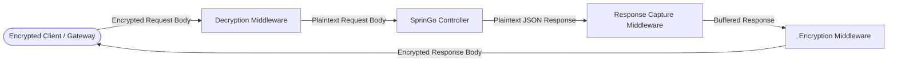

# 🔐 Step-by-Step Guide: Payload Transformation & Encryption Middleware

This tutorial demonstrates how to build bidirectional payload transformation middleware in SprinGo: decrypting and
validating incoming HTTP request bodies and encrypting/signing outgoing HTTP responses before they reach the client
using `web.ResponseCaptureMiddleware` and `web.RouteGroup`.

---

## 1. Overview & Architecture

In fintech, healthcare, and high-security enterprise APIs, payload encryption (e.g., AES-GCM, JWE) or integrity verification
(HMAC signatures) is required at the transport perimeter:



SprinGo combines two primitives:
1. **Request Stream Rewriting**: Intercepting `r.Body`, decrypting raw bytes, and resetting `r.Body = io.NopCloser(...)`.
2. **Response Buffering (`web.ResponseCaptureMiddleware`)**: Capturing status codes, headers, and outgoing body in memory
   so wrapping middlewares can encrypt or mutate the response before transmission.

---

## 2. Bidirectional Encryption Middleware

**Suggested File Path**: `internal/infrastructure/middleware/payload_crypto_middleware.go`

```go
package middleware

import (
    "bytes"
    "crypto/aes"
    "crypto/cipher"
    "crypto/rand"
    "encoding/hex"
    "fmt"
    "io"
    "net/http"
    "strconv"

    "github.com/NeftaliAcosta/springo/framework/web"
)

// PayloadCryptoMiddleware decrypts incoming request payloads and encrypts outgoing response bodies.
func PayloadCryptoMiddleware(secretKey []byte) func(http.Handler) http.Handler {
    return func(next http.Handler) http.Handler {
        return http.HandlerFunc(func(w http.ResponseWriter, r *http.Request) {
            // 1. Process Incoming Request: Decrypt body if 'X-Encrypted: true'
            if r.Header.Get("X-Encrypted") == "true" && r.Body != nil {
                rawCiphertext, err := io.ReadAll(r.Body)
                _ = r.Body.Close()

                if err != nil {
                    http.Error(w, `{"error":"failed to read encrypted body"}`, http.StatusBadRequest)
                    return
                }

                if len(rawCiphertext) > 0 {
                    plaintext, err := decryptAESGCM(rawCiphertext, secretKey)
                    if err != nil {
                        http.Error(w, `{"error":"invalid payload ciphertext"}`, http.StatusUnprocessableEntity)
                        return
                    }

                    // Replace request body with decrypted plaintext stream
                    r.Body = io.NopCloser(bytes.NewReader(plaintext))
                    r.ContentLength = int64(len(plaintext))
                }
            }

            // 2. Execute downstream controllers and handlers
            next.ServeHTTP(w, r)

            // 3. Process Outgoing Response: Encrypt captured response body
            captured, ok := web.GetCapturedResponse(r.Context())
            if !ok || len(captured.Body) == 0 {
                return
            }

            // Encrypt buffered response payload
            ciphertext, err := encryptAESGCM(captured.Body, secretKey)
            if err != nil {
                captured.StatusCode = http.StatusInternalServerError
                captured.Body = []byte(`{"error":"failed to encrypt response"}`)
                return
            }

            // Mutate captured body and headers before flush
            captured.Body = ciphertext
            captured.Headers.Set("X-Encrypted", "true")
            captured.Headers.Set("Content-Type", "application/octet-stream")
            captured.Headers.Set("Content-Length", strconv.Itoa(len(ciphertext)))
        })
    }
}

// Helper: AES-GCM 256 Decryption
func decryptAESGCM(data []byte, key []byte) ([]byte, error) {
    block, err := aes.NewCipher(key)
    if err != nil {
        return nil, err
    }
    gcm, err := cipher.NewGCM(block)
    if err != nil {
        return nil, err
    }
    nonceSize := gcm.NonceSize()
    if len(data) < nonceSize {
        return nil, fmt.Errorf("ciphertext too short")
    }
    nonce, ciphertext := data[:nonceSize], data[nonceSize:]
    return gcm.Open(nil, nonce, ciphertext, nil)
}

// Helper: AES-GCM 256 Encryption
func encryptAESGCM(plaintext []byte, key []byte) ([]byte, error) {
    block, err := aes.NewCipher(key)
    if err != nil {
        return nil, err
    }
    gcm, err := cipher.NewGCM(block)
    if err != nil {
        return nil, err
    }
    nonce := make([]byte, gcm.NonceSize())
    if _, err := io.ReadFull(rand.Reader, nonce); err != nil {
        return nil, err
    }
    return gcm.Seal(nonce, nonce, plaintext, nil), nil
}
```

---

## 3. Registering Scoped Route Groups with Encryption

Apply the crypto pipeline only to sensitive endpoints using `web.RouteGroup`:

**Suggested File Path**: `internal/interfaces/rest/payment_controller.go`

```go
package rest

import (
    "context"
    "net/http"

    "github.com/NeftaliAcosta/springo/framework/ioc"
    "github.com/NeftaliAcosta/springo/framework/web"
    "github.com/go-chi/chi/v5"
    "github.com/your-org/your-app/internal/infrastructure/middleware"
)

type SecurePaymentController struct{}

type TransferRequest struct {
    FromAccount string  `json:"fromAccount" validate:"required"`
    ToAccount   string  `json:"toAccount" validate:"required"`
    Amount      float64 `json:"amount" validate:"gt=0"`
}

type TransferResponse struct {
    TransactionID string `json:"transactionId"`
    Status        string `json:"status"`
}

func init() {
    ioc.RegisterBean("securePaymentController", &SecurePaymentController{})

    // 32-byte AES-256 key
    aesKey := []byte("01234567890123456789012345678901")

    // Secure Route Group with ResponseCaptureMiddleware outer and CryptoMiddleware inner
    web.RouteGroup("/api/v1/secure-transfers", []func(http.Handler) http.Handler{
        web.ResponseCaptureMiddleware,
        middleware.PayloadCryptoMiddleware(aesKey),
    }, func(r chi.Router) {
        c, _ := ioc.Get[SecurePaymentController]("securePaymentController")
        r.Post("/", web.Dispatch(c.executeTransfer))
    })
}

func (c *SecurePaymentController) executeTransfer(ctx context.Context, req TransferRequest) (TransferResponse, error) {
    // Controller receives transparently decrypted request and returns standard Go struct
    return TransferResponse{
        TransactionID: "tx-987654321",
        Status:        "COMPLETED",
    }, nil
}
```
